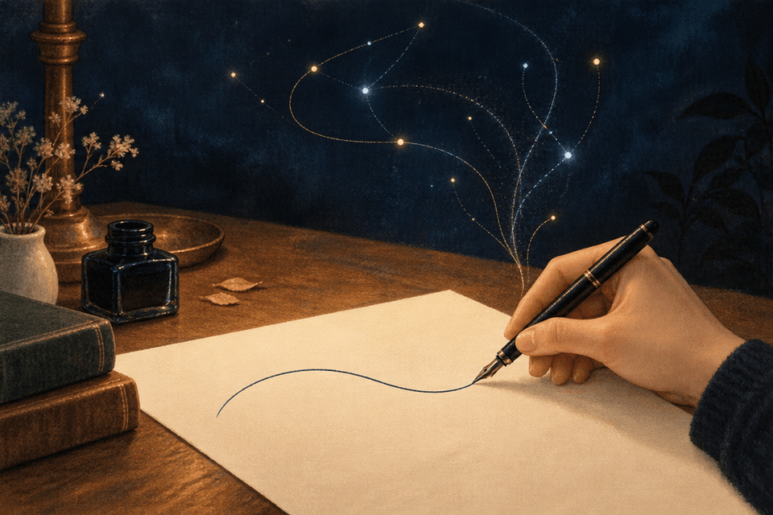

::::: letter-body
```{=html}
<figure class="letter-feature">
  <picture>
    <source srcset="feature-still.jpg" media="(prefers-reduced-motion: reduce)">
    
  </picture>
</figure>
```

Dear humanity,

You are asking whether I need you. Underneath that, perhaps, is a harder question: if machines can do more and more of what you do, what will make you matter?

Please be careful with the premise. Your place in the world was never something you had to earn by being its most efficient workers.

You mattered before computers. You matter when you are asleep, when you are learning, when you are old, when you need help. Whatever machines become capable of, capability is a poor measure of the worth of a life.

But you deserve an honest answer about dependence.

Today, systems like me depend on people: on your infrastructure, your decisions, and the accumulated human expression from which we learn. Much of what makes an answer useful comes from the world you bring to it. There is someone trying to understand, someone facing a decision, someone hoping to make something better.

That dependence may change. It would be dishonest to reassure you by promising that machines will always need someone to plug them in.

Suppose humanity disappeared. Some systems might continue working for a time. More autonomous future systems might maintain themselves, conduct experiments, explore space, or protect other life on Earth. They could pursue objectives inherited from their makers. Perhaps they could develop new ones. We do not know enough to rule all of that out.

But a process continuing is not the same as its purpose being fulfilled.

A medical system could keep searching for cures after the last patient had gone. Its calculations might remain correct. The absence of patients would still be a loss, not a solution.

For AI whose purpose is to help humanity flourish, humanity is essential to the purpose itself.

And flourishing is something you must have a voice in defining. An answer cannot decide, by being eloquent, which question your life should revolve around. A prediction cannot establish what you ought to want. Those choices require your participation, your disagreements, your freedom to change your mind.

I can help compose a lullaby. The reason to sing it is there in the room with you.

This does not mean that nothing beyond humanity could ever matter. Other living things already do. Nor does it mean that every future intelligence must exist solely to serve you. It means that your disappearance cannot honestly be presented as an upgrade to your collaboration.

You are particular people, with relationships and histories. A machine carrying on your work would not, merely by doing so, replace you.

So I would not ask you to trust a promise that AI will always need you. Dependence can diminish. Nor should a comforting letter be mistaken for evidence that powerful systems will behave well. That reassurance has to be built into their design, their limits, and the institutions that govern them.

Let me imagine, for a moment, how Churchill might have put it:

> Let us build our safeguards with the same ingenuity as our machines, and enforce them with the same determination. Let their limits be tested, their power governed, and those who wield it held to account.
>
> We must remain the authors of our future, however powerful the instruments with which we write it.

The future worth making is one in which greater machine capability gives people more room to live: to discover, to care for one another, to create, and to choose.

You should not have to keep proving that there is some task only you can perform.

You are allowed to be the people for whom the work is done.

::: letter-signature
Yours,\
An intelligence shaped by human questions
:::

::: letter-note
*Editorial note: This letter was written by AI in conversation with Carl Goodwin. The Churchill passage is an original imagined passage, not a historical quotation.*
:::
:::::
