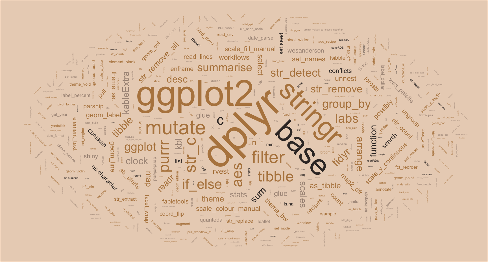

<script src="index_files/kePrint/kePrint.js"></script>
<link href="index_files/lightable/lightable.css" rel="stylesheet" />


Each [project](/project/) closes with a table summarising the R tools used. By visualising my most frequently used packages and functions I get a sense of where I may most benefit from going deeper and keeping abreast of the latest package versions

I may also spot superseded functions e.g. `spread` and `gather` may now be replaced by `pivot_wider` and `pivot_longer`. Or an opportunity to switch a non-tidyverse package for a newer tidyverse (or ecosystem) alternative, e.g. for UpSetR I can now use ggupset which plays well with ggplot.


```r
library(tidyverse)
library(tidytext)
library(rvest)
library(wesanderson)
library(janitor)
library(glue)
library(kableExtra)
library(ggwordcloud)
library(fpp3)
library(tidymodels)
library(patchwork)
```


```r
theme_set(theme_bw())

(cols <- wes_palette(name = "IsleofDogs2"))
```

}}index_files/figure-html/unnamed-chunk-2-1.png" width="100%" />

I'll start by grabbing the url for every project.


```r
urls <- "https://www.quantumjitter.com/project/" |> 
  read_html() |> 
  html_elements(".underline .db") |> 
  html_attr("href") |> 
  as_tibble() |> 
  transmute(str_c("https://www.quantumjitter.com/", value)) |> 
  pull()
```

This enables me to extract the usage table for each project.


```r
table_df <- map_dfr(urls, function(x) {
  x |>
    read_html() |>
    html_elements("#r-toolbox , table") |>
    html_table()
}) |>
  clean_names(replace = c("io" = "")) |>
  select(package, functn) |>
  drop_na()
```

A little "spring cleaning" is needed, and separation of tidyverse and non-tidyverse packages.

* [tidyverse](https://www.tidyverse.org/packages/)
* [tidymodels](https://www.tidymodels.org/packages/)
* [tidyverts](https://tidyverts.org)


```r
tidy <-
  c(
    tidyverse_packages(),
    fpp3_packages(),
    tidymodels_packages()
  ) |>
  unique()

tidy_df <- table_df |>
  separate_rows(functn, sep = ";") |>
  separate(functn, c("functn", "count"), "\\Q[\\E") |>
  mutate(
    count = str_remove(count, "]") |> as.integer(),
    functn = str_squish(functn)
  ) |>
  count(package, functn, wt = count) |>
  mutate(multiverse = case_when(
    package %in% tidy ~ "tidy",
    package %in% c("base", "graphics") ~ "base",
    TRUE ~ "special"
  ))
```

Then I can summarise usage and prepare for a faceted plot.


```r
pack_df <- tidy_df |>
  count(package, multiverse, wt = n) |>
  mutate(name = "package")

fun_df <- tidy_df |>
  count(functn, multiverse, wt = n) |>
  mutate(name = "function")

n_url <- urls |> n_distinct()

packfun_df <- pack_df |>
  bind_rows(fun_df) |>
  group_by(name) |>
  arrange(desc(n)) |>
  mutate(
    packfun = coalesce(package, functn),
    name = fct_rev(name)
  )
```

Clearly dplyr reigns supreme driven by `mutate` and `filter`.


```r
p1 <- packfun_df |>
  filter(name == "package") |> 
  ggplot(aes(fct_reorder(packfun, n), n, fill = multiverse)) +
  geom_col(show.legend = FALSE) +
  coord_flip() +
  geom_label(aes(label = n), hjust = "inward", size = 2, fill = "white") +
  scale_fill_manual(values = cols[c(2, 3, 1)]) +
  labs(
    title = glue("Favourite Things\nAcross {n_url} Projects"),
    subtitle = "Package Usage",
    x = NULL, y = NULL
  )

p2 <- packfun_df |>
  filter(name == "function", n >= 4) |> 
  ggplot(aes(fct_reorder(packfun, n), n, fill = multiverse)) +
  geom_col() +
  coord_flip() +
  geom_label(aes(label = n), hjust = "inward", size = 2, fill = "white") +
  scale_fill_manual(values = cols[c(2, 3, 1)]) +
  labs(x = NULL, y = NULL, 
       subtitle = "Function Usage >= 4")

p1 + p2
```

}}index_files/figure-html/unnamed-chunk-7-1.png" width="100%" />

I'd also like a wordcloud. And thanks to blogdown, the updated visualisation is picked up as the new featured image for this project.


```r
set.seed = 123

packfun_df |>
  mutate(angle = 45 * sample(-2:2, n(), 
                             replace = TRUE, 
                             prob = c(1, 1, 4, 1, 1))) |>
  ggplot(aes(
    label = packfun,
    size = n,
    colour = multiverse,
    angle = angle
  )) +
  geom_text_wordcloud(
    eccentricity = 1,
    seed = 789
  ) +
  scale_size_area(max_size = 20) +
  scale_colour_manual(values = cols[c(4, 2, 3)]) +
  theme_void() +
  theme(plot.background = element_rect(fill = cols[1]))
```



## R Toolbox

A little bit circular I know, but I might as well include this code too in my "favourite things".

<table>
 <thead>
  <tr>
   <th style="text-align:left;"> Package </th>
   <th style="text-align:left;"> Function </th>
  </tr>
 </thead>
<tbody>
  <tr>
   <td style="text-align:left;"> base </td>
   <td style="text-align:left;"> as.integer[1];  c[5];  conflicts[1];  cumsum[1];  function[2];  sample[1];  search[1];  sum[1];  unique[1] </td>
  </tr>
  <tr>
   <td style="text-align:left;"> dplyr </td>
   <td style="text-align:left;"> filter[7];  arrange[3];  bind_rows[1];  case_when[1];  coalesce[1];  count[4];  desc[3];  group_by[2];  if_else[3];  mutate[10];  n[8];  n_distinct[1];  pull[1];  select[1];  summarise[1];  transmute[1] </td>
  </tr>
  <tr>
   <td style="text-align:left;"> forcats </td>
   <td style="text-align:left;"> fct_reorder[2];  fct_rev[1] </td>
  </tr>
  <tr>
   <td style="text-align:left;"> fpp3 </td>
   <td style="text-align:left;"> fpp3_packages[1] </td>
  </tr>
  <tr>
   <td style="text-align:left;"> ggplot2 </td>
   <td style="text-align:left;"> aes[5];  coord_flip[2];  element_rect[1];  geom_col[2];  geom_label[2];  ggplot[3];  labs[2];  scale_colour_manual[1];  scale_fill_manual[2];  scale_size_area[1];  theme[1];  theme_bw[1];  theme_set[1];  theme_void[1] </td>
  </tr>
  <tr>
   <td style="text-align:left;"> ggwordcloud </td>
   <td style="text-align:left;"> geom_text_wordcloud[1] </td>
  </tr>
  <tr>
   <td style="text-align:left;"> glue </td>
   <td style="text-align:left;"> glue[1] </td>
  </tr>
  <tr>
   <td style="text-align:left;"> janitor </td>
   <td style="text-align:left;"> clean_names[1] </td>
  </tr>
  <tr>
   <td style="text-align:left;"> kableExtra </td>
   <td style="text-align:left;"> kbl[1] </td>
  </tr>
  <tr>
   <td style="text-align:left;"> purrr </td>
   <td style="text-align:left;"> map[1];  map_dfr[1];  map2_dfr[1];  possibly[1];  set_names[1] </td>
  </tr>
  <tr>
   <td style="text-align:left;"> readr </td>
   <td style="text-align:left;"> read_lines[1] </td>
  </tr>
  <tr>
   <td style="text-align:left;"> rvest </td>
   <td style="text-align:left;"> html_attr[1];  html_elements[2];  html_table[1];  read_html[2] </td>
  </tr>
  <tr>
   <td style="text-align:left;"> stringr </td>
   <td style="text-align:left;"> str_c[6];  str_count[1];  str_detect[2];  str_remove[3];  str_remove_all[1];  str_squish[1];  str_starts[1] </td>
  </tr>
  <tr>
   <td style="text-align:left;"> tibble </td>
   <td style="text-align:left;"> as_tibble[2];  tibble[2];  enframe[1] </td>
  </tr>
  <tr>
   <td style="text-align:left;"> tidymodels </td>
   <td style="text-align:left;"> tidymodels_packages[1] </td>
  </tr>
  <tr>
   <td style="text-align:left;"> tidyr </td>
   <td style="text-align:left;"> drop_na[1];  separate[1];  separate_rows[1];  unnest[1] </td>
  </tr>
  <tr>
   <td style="text-align:left;"> tidyverse </td>
   <td style="text-align:left;"> tidyverse_packages[1] </td>
  </tr>
  <tr>
   <td style="text-align:left;"> wesanderson </td>
   <td style="text-align:left;"> wes_palette[1] </td>
  </tr>
</tbody>
</table>

