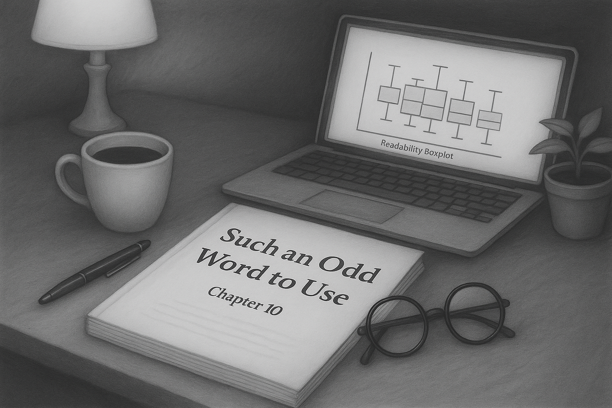

{.profile-img fig-alt="AI-assisted digital composition of the book manuscript and a laptop displaying a boxplot."}

<br>

A little under a year ago, I embarked on a journey to write my first novel *Such an Odd Word to Use* — more accurately a novella given its 31.5k words. The process was both exhilarating and challenging, pushing me to explore new creative depths. It was also a chance to deploy my skills in data analysis and visualization in a novel context — literally.

On my author website, also built with Quarto, I wrote a [blog post](https://carlgoodwin.com/blog/analysis/analysis) comparing my writing style to established literature using R and the `quanteda` package. This version of that same post incorporates the R code used to delve into the structure and readability of my manuscript.

<br>

::: callout-note
My manuscript is not in the repository, but the code should be reproducible for the Gutenberg books. If you are interested in reading the novella, I'm running time-bound giveaways for *Such an Odd Word to Use* on my [author site](https://carlgoodwin.com).
:::

::: {style="text-align:center; margin: 2rem 0;"}

:::

```{r}
#| messages: false

library(conflicted)
library(tidyverse)
library(quanteda)
library(quanteda.textstats)
library(quanteda.textplots)
library(readtext)
library(glue)
library(scales)
library(gutenbergr)
library(usedthese)
library(ggfoundry)

conflicts_prefer(
  ggplot2::annotate,
  readtext::texts,
  quanteda::tokens,
  dplyr::filter
)

conflict_scout()

set_theme(theme_bw(paper = "#ddd9d7", ink = "#181d1e"))
```

```{r}
#| warning: false
#| fig-height: 4

# One-time Convert PDF → text
# system2("pdftotext", args = c("-nopgbrk", "manuscript.pdf", "manuscript.txt"))

book_text <- readtext("manuscript.txt")

# Define a regular expression for your section headers
section_pattern <-
  regex("\\b(Chapter\\s+\\d+|Prologue|Disclaimer|Acknowledgements)\\b")

# Split based on this pattern
sections <- str_split(book_text$text, section_pattern)[[1]]

# Extract headers separately to keep them
headers <- str_extract_all(book_text$text, section_pattern)[[1]]

head_foot <-
  regex("carl goodwin|\\n\\n\\n\\s*[0-9]+\\n\\n|vii|such an odd word to use")

# Combine headers and content into a tibble
book_split <- tibble(
  heading = str_to_title(headers),
  text = str_trim(sections[-1]) # -1 drop preamble before first heading
) |>
  mutate(text = str_remove_all(text, head_foot) |> str_squish())

book_corp <- book_split |>
  corpus(docid_field = "heading")

book_toks <- book_corp |>
  ntoken(split_hyphens = TRUE, remove_punct = TRUE) |>
  as_tibble(rownames = "heading") |>
  filter(str_starts(heading, "Chapter|Prologue")) |>
  mutate(
    heading = fct_inorder(heading), # Preserve factor order
    cum_toks = cumsum(value)
  )

word_count <- comma(sum(book_toks$value))

avg_words <- mean(book_toks$value)
```

```{r}
#| warning: false
#| fig-height: 5
#| fig-width: 12

book_toks |>
  ggplot(aes(heading, value)) +
  geom_col(fill = "#82b777", colour = "#181d1e") +
  geom_hline(yintercept = avg_words, linetype = "dashed") +
  # Label just right of the chapter-axis midpoint
  annotate(
    "label",
    x = nlevels(book_toks$heading) - 11.5,
    y = avg_words,
    label = "Average"
  ) +
  labs(
    title = glue("Such an Odd Word to Use -- {word_count} Words"),
    x = NULL,
    y = "Words"
  ) +
  theme(axis.text.x = element_text(angle = 45, hjust = 1))
```

::: {style="text-align:center; margin: 2rem 0;"}

:::

To explore how *Such an Odd Word to Use* compares to classic literature in style and complexity, I analysed its readability using the Flesch-Kincaid grade level — an estimate of the US school year required to understand a given text. This metric was calculated chapter by chapter, revealing how the reading complexity varies across the book.

For comparison, I drew on works from [Project Gutenberg](https://www.gutenberg.org), a digital library of public domain classics. Selecting works of a similar length, and after stripping out introductory front matter, I computed the same chapter-level readability and word counts for each title. This allowed a side-by-side view of how *Such an Odd Word to Use* sits in relation to the established canon — not just in overall difficulty, but in how that difficulty shifts over the course of the narrative.

<br>

```{r}
#| cache: true

books <- gutenberg_download(
  c(11, 42, 2097, 19337, 64317),
  meta_fields = c("title", "author")
) |>
  distinct() |>
  mutate(
    front_matter = case_when(
      author == "Carroll, Lewis" & row_number() <= 17 ~ 1,
      author == "Doyle, Arthur Conan" & row_number() <= 17 ~ 1,
      author == "Dickens, Charles" & row_number() <= 83 ~ 1,
      author == "Stevenson, Robert Louis" & row_number() <= 22 ~ 1,
      author == "Fitzgerald, F. Scott (Francis Scott)" & row_number() <= 22 ~ 1,
      .default = 0
    ),
    .by = title
  )
```

```{r}
#| warning: false
#| fig-height: 4
#| fig-width: 12

methods <- c("Flesch.Kincaid")

such <- book_split |>
  rename(chapter = heading) |>
  filter(str_starts(chapter, "Chapter|Prologue")) |>
  mutate(
    title = "Such an Odd Word to Use",
    author = "Goodwin, Carl",
    chapter = coalesce(as.numeric(str_extract(chapter, "\\d+")), 0),
    # Leading run of title-case words, permitting lower-case "the"/"and";
    # NA when the first word is not title-case
    chapter_name = str_match(
      text,
      paste0(
        "^((?:[\\p{Lu}][\\p{Ll}’']*(?:-[\\p{Lu}][\\p{Ll}’']*)?|the|and)",
        "(?:\\s+(?:[\\p{Lu}][\\p{Ll}’']*(?:-[\\p{Lu}][\\p{Ll}’']*)?|the|and))*)"
      )
    )[, 2],
    chapter_name = na_if(chapter_name, ""),
    chapter_name = str_remove(chapter_name, "\\s+\\S+$"),
    chapter_name = str_remove(chapter_name, "As$|Amid$|In$|Over$"),
    chapter_name = if_else(chapter == 0, "Prologue", chapter_name)
  )

pattern <- "chapter|scene|the prologue|stave"

books_corp <- books |>
  filter(front_matter != 1) |>
  mutate(
    text = if_else(
      str_detect(text, "^[[:upper:]]{2}") & author == "Stevenson, Robert Louis",
      str_c("Chapter ", text),
      text
    ),
    text = if_else(
      str_length(str_squish(text)) <= 4 & title == "The Great Gatsby",
      str_c("Chapter ", str_squish(text)),
      text
    ),
    chapter = cumsum(str_starts(text, regex(pattern, ignore_case = TRUE))),
    .by = title
  ) |>
  bind_rows(such) |>
  summarise(
    text = str_c(text, collapse = " "),
    .by = c("title", "author", "chapter")
  ) |>
  mutate(doc_id = str_c(title, author, chapter, sep = "|")) |>
  corpus()

# Insert a break at 1 so numbers below 1,000 are left uncut
n_words <- label_number(
  accuracy = 0.1,
  scale_cut = append(cut_short_scale(), 1, 1)
)

books_toks <- books_corp |>
  ntoken(split_hyphens = TRUE, remove_punct = TRUE) |>
  as_tibble(rownames = "doc") |>
  separate_wider_delim(
    doc,
    delim = "|",
    names = c("title", "author", "chapter")
  ) |>
  summarise(words = sum(value), .by = c("title", "author")) |>
  mutate(
    title = str_c(title, " | ", author),
    words = n_words(words)
  )

readability_df <- books_corp |>
  textstat_readability(measure = methods) |>
  pivot_longer(cols = !document) |>
  separate_wider_delim(
    document,
    delim = "|",
    names = c("title", "author", "chapter")
  )

readability_df |>
  mutate(
    title = str_c(title, " | ", author),
    fill = if_else(str_detect(title, "Such"), "#82b777", NA)
  ) |>
  ggplot(aes(value, title)) +
  geom_boxplot(aes(fill = fill)) +
  geom_text(
    aes(x = -Inf, y = title, label = words),
    size = 3,
    hjust = -0.3,
    data = books_toks
  ) +
  scale_fill_identity() +
  scale_x_continuous(expand = expansion(mult = 0.12)) +
  labs(
    x = "Score",
    y = NULL,
    title = "Readability Boxplot (Flesch-Kincaid)",
    subtitle = "Dot = Outlier Chapter"
  ) +
  theme(axis.text.y = element_text(size = 9))
```

```{r}
#| warning: false

read_df <- such |>
  mutate(doc_id = str_c(chapter, " | ", chapter_name)) |>
  corpus() |>
  textstat_readability(measure = methods) |>
  pivot_longer(cols = !document) |>
  rename(chapter = document) |>
  mutate(chapter = fct_inorder(chapter))

avgs <- read_df |>
  summarise(avg_score = mean(value), .by = name)
```

Chapters with a more conversational tone — such as the Lana-focused Chapters 19 and 23 — tend to be easier to read, while more analytical sections, like the cypher-driven Chapter 26, are more complex. The overall Flesch-Kincaid Grade Level score averages `r round(avgs$avg_score, 1)`, indicating the text is suitable for readers at a middle to early high school level (roughly ages 13–15), which aligns with the book’s intended accessibility.

<br>

```{r}
#| warning: false
#| fig-height: 4
#| fig-width: 12

read_df |>
  ggplot(aes(chapter, value, group = name)) +
  geom_hline(
    aes(yintercept = avg_score),
    linetype = "dashed",
    colour = "grey80",
    data = avgs
  ) +
  geom_label(
    aes(
      "15 | Pancakes and Paranoia",
      avg_score,
      label = glue("Average\n{round(avgs$avg_score, 1)}")
    ),
    nudge_y = -1.5,
    size = 3,
    data = avgs
  ) +
  geom_line(colour = "#82b777") +
  geom_casting(shape = "quill", size = 0.3, fill = "#82b777") +
  coord_cartesian(ylim = c(0, 14), expand = TRUE) +
  labs(
    x = NULL,
    y = "Score",
    title = "Such an Odd Word to Use",
    subtitle = "Chapter Readability (Flesch-Kincaid)"
  ) +
  theme(
    axis.text.x = element_text(angle = 55, hjust = 1),
    legend.position = "none"
  )
```

::: {style="text-align:center; margin: 2rem 0;"}

:::

A lexical dispersion plot visualizes where and how often key characters are mentioned across the chapters. It highlights patterns in their narrative presence — for example, Alistair (the antagonist) appears consistently throughout, suggesting a sustained influence on the storyline. Lana (an ally) is introduced early but becomes more prominent in later chapters. Imogen (a supporting character) is mentioned more sparingly, reflecting her secondary role in the narrative arc.

<br>

```{r}
#| warning: false
#| fig-height: 5
#| fig-width: 12

such |>
  mutate(docid = str_c(chapter, " | ", chapter_name)) |>
  corpus(docid_field = "docid") |>
  tokens(split_hyphens = TRUE) |>
  kwic(
    pattern = c("Alistair", "Lana", "Imogen"),
    valuetype = "fixed"
  ) |>
  textplot_xray() +
  scale_x_continuous(
    breaks = c(0, 0.5, 1),
    labels = c("Start", "Middle", "End")
  ) +
  labs(
    x = "Relative Position in Chapter",
    y = "Chapter",
    title = "Lexical Dispersion - Character Appearance"
  ) +
  theme(
    panel.spacing.x = unit(0.5, "lines"),
    legend.position = "none",
    strip.background = element_rect(fill = "#82b777", colour = "#181d1e"),
    panel.background = element_rect(fill = "#ddd9d7", colour = NA),
    plot.background = element_rect(fill = "#ddd9d7", colour = NA)
  )
```

::: {style="text-align:center; margin: 2rem 0;"}

:::

## R Toolbox

Summarizing below the packages and functions used in this post enables me to separately create a [toolbox visualization](/project/box) summarizing the usage of packages and functions across all posts.

```{r}
#| label: toolbox

used_here()
```
