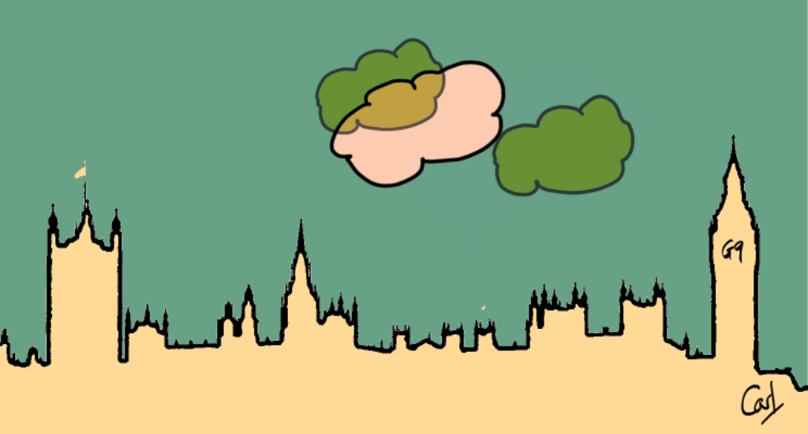

{fig-alt="A silhouette of the Houses of Parliament with the text \"G9\" instead of Big Ben's clock. Three semi-transparent clouds move across the sky mimicing a Venn diagram."}

When visualising a small number of overlapping sets, [Venn diagrams](https://en.wikipedia.org/wiki/Venn_diagram) work well. But what if there are more. Here's a [tidyverse](https://www.tidyverse.org) approach to the exploration of sets and their intersections.

In [Let's Jitter](/project/jitter) I looked at a relatively simple set of cloud-service-related sales data. [G-Cloud data](https://www.digitalmarketplace.service.gov.uk/g-cloud/search) offers a much richer source with many thousands of services documented by several thousand suppliers and hosted across myriad web pages. These services straddle many categories. I'll use these data to explore the sets and where they cross.

```{r}
#| label: libraries

library(conflicted)
library(tidyverse)
library(rvest)
library(mirai)
library(tictoc)
library(ggupset)
library(ggVennDiagram)
library(glue)
library(paletteer)
library(ggfoundry)
library(usedthese)

conflict_prefer_all("dplyr", quiet = TRUE)
conflict_scout()

daemons(10)
```

```{r}
#| label: theme
#| dev.args: { bg: "transparent" }

theme_set(theme_bw())

pal_name <- "wesanderson::Royal2"

pal <- paletteer_d(pal_name)

display_palette(pal, pal_name)
```

I'm going to focus on Lot 1a: Infrastructure as a Service (IaaS) and Platform as a Service (PaaS), the successor to the old Cloud Hosting lot in the current G-Cloud framework. Suppliers document the services they want to offer to Public Sector buyers. Each supplier is free to assign each of their services to one or more service categories. It would be interesting to see how these categories overlap when looking at the aggregated data.

I'll begin by harvesting each category's taxonomy value and service count from the lot's search page. Service categories now form a nested taxonomy tree, where a parent such as IaaS Compute rolls up all of its children. I'll keep only the leaf categories so that sets don't double-count parent and child memberships. I'll also capture the number of search pages for each category, to control how R iterates through the web pages to extract the required data.

```{r}
#| label: categories

path <- "https://www.applytosupply.digitalmarketplace.service.gov.uk/g-cloud/search"

lot <- "iaas-and-paas"

lot_label <- "Lot 1a"

lot_page <- str_c(path, "?lot=", lot) |>
  read_html()

is_leaf <- \(values) {
  map_lgl(values, \(v) !any(str_detect(values, str_c("^", fixed(v), "-"))))
}

cat_urls <-
  lot_page |>
  html_elements('input[name="serviceCategories"]') |>
  map(\(input) {
    tibble(
      value = html_attr(input, "value"),
      label = input |>
        html_element(xpath = "following-sibling::label") |>
        html_text2()
    )
  }) |>
  list_rbind() |>
  filter_out(is.na(value), is.na(label)) |>
  filter(is_leaf(value)) |>
  mutate(
    category = str_remove(label, "\\s*\\([0-9,]+\\)\\s*$"),
    n_services = as.numeric(str_extract(label, "\\d+")),
    pages = ceiling(n_services / 30),
    url = str_c("&serviceCategories=", value)
  ) |>
  select(url, pages, category)

version <- lot_page |>
  html_elements(".app-search-result:first-child") |>
  html_text() |>
  str_extract("G-Cloud \\d\\d")
```

So now I'm all set to parallel process through the data. {mirai} [@mirai] will fan out across the daemons, iterating through the pages of search results for each category, harvesting 30 service IDs per page. I'll also auto-abbreviate the category names so I'll have the option of more concise names for less-cluttered plotting later on.

::: callout-tip
Hover over the numbered code annotation symbols for REGEX explanations.
:::

```{r}
#| label: service ids
#| cache: true

tic()

scrape_ids <- possibly(
  \(url, page, category, path, lot, lot_label) {
    refs <- stringr::str_c(
      path,
      "?page=",
      page,
      url,
      "&lot=",
      lot
    ) |>
      rvest::read_html() |>
      rvest::html_elements("#js-dm-live-search-results .govuk-link") |>
      rvest::html_attr("href")

    tibble::tibble(
      lot = lot_label,
      service_id = stringr::str_extract(refs, "[[:digit:]]{15}"), # <1>
      category = category
    )
  },
  otherwise = NULL
)

scraped <- mirai_map(
  uncount(cat_urls, pages, .id = "page"),
  scrape_ids,
  .args = list(path = path, lot = lot, lot_label = lot_label)
)[.progress]

data_df <-
  scraped |>
  list_rbind() |>
  mutate(
    abbr = str_remove(category, "and") |> abbreviate(3) |> str_to_upper()
  ) |>
  filter_out(is.na(service_id)) |>
  distinct()

toc()
```

1.  `[[:digit:]]{15}` finds the 15-digit service ID in the scraped link.

Now that I have a nice tidy [tibble](https://tibble.tidyverse.org) [@tibble], I can start to think about visualisations.

I like Venn diagrams. But to create one I'll first need to do a little prep as ggVennDiagram [@ggVennDiagram] requires separate character vectors for each set.

```{r}
#| label: vectors

all_cats <- data_df |>
  summarise(ids = list(service_id), .by = abbr) |>
  tibble::deframe()
```

Venn diagrams work best with a small number of sets. So we'll select four categories.

```{r}
#| label: venn

four_cats <- all_cats[c("GNP", "CMO", "OOB", "BRMT")]

four_cats |>
  ggVennDiagram(label = "count", label_alpha = 0) +
  scale_fill_gradient(low = pal[5], high = pal[3]) +
  scale_colour_manual(values = rep(pal[4], 4)) +
  labs(
    x = "Category Combinations",
    y = NULL,
    fill = "# Services",
    title = "The Most Frequent Category Combinations",
    subtitle = glue("Focusing on Four {version} Service Categories"),
    caption = "Source: digitalmarketplace.service.gov.uk\n"
  )
```

Let's suppose I want to find out which Service IDs lie in a particular intersection. Perhaps I want to go back to the web site with those IDs to search for, and read up on, those particular services. I could use {purrr}'s `reduce` to achieve this. For example, let's extract the IDs at the heart of the Venn which intersect all categories.

```{r}
#| label: four cats

four_cats |> reduce(intersect)
```

And if we wanted the IDs intersecting the "OOB" and "BRMT" categories?

```{r}
#| label: obs-ind

four_cats[c("OOB", "BRMT")] |> reduce(intersect)
```

Sometimes though we need something a little more scalable than a Venn diagram. The {ggupset} package provides a good solution. Before we try more than four sets though, I'll first use the same four categories so we may compare the visualisation to the Venn.

```{r}
#| label: frequent

make_set_df <- \(df) {
  df |>
    mutate(category = list(sort(unique(category))), .by = service_id) |>
    distinct(service_id, category) |>
    mutate(n = n(), .by = category)
}

top_combos <- \(df, k) {
  keep <- df |>
    distinct(category, n) |>
    slice_max(n, n = k, with_ties = FALSE)

  semi_join(df, keep, by = "category")
}

set_df <- data_df |>
  filter(abbr %in% c("GNP", "CMO", "OOB", "BRMT")) |>
  make_set_df()

set_df |>
  ggplot(aes(category)) +
  geom_bar(fill = pal[1]) +
  geom_label(
    aes(y = n, label = n),
    data = \(d) distinct(d, category, n),
    vjust = -0.1,
    size = 3,
    fill = pal[5]
  ) +
  scale_x_upset() +
  scale_y_continuous(expand = expansion(mult = c(0, 0.15))) +
  theme(panel.border = element_blank()) +
  labs(
    x = "Category Combinations",
    y = NULL,
    title = "The Most Frequent Category Combinations",
    subtitle = glue("Focusing on Four {version} Service Categories"),
    caption = "Source: digitalmarketplace.service.gov.uk"
  )
```

Now let's take a look at the intersections across all the categories. And let's suppose that our particular interest is all services which appear in one, and only one, category.

```{r}
#| label: singles

set_df <- data_df |>
  filter(n() == 1, .by = service_id) |>
  make_set_df() |>
  top_combos(10)

set_df |>
  ggplot(aes(category)) +
  geom_bar(fill = pal[2]) +
  geom_label(
    aes(y = n, label = n),
    data = \(d) distinct(d, category, n),
    vjust = -0.1,
    size = 3,
    fill = pal[3]
  ) +
  scale_x_upset() +
  scale_y_continuous(expand = expansion(mult = c(0, 0.15))) +
  theme(panel.border = element_blank()) +
  labs(
    x = "Category Combinations",
    y = NULL,
    title = "10 Most Frequent Single-Category Services",
    subtitle = "Service Categories in the IaaS and PaaS Lots",
    caption = "Source: digitalmarketplace.service.gov.uk"
  )
```

Suppose we want to extract the intersection data for the top intersections across all sets. I can flatten each service's categories into a single sorted label, then count, using {dplyr} [@dplyr] and {stringr}.

```{r}
#| label: intersection data

flatten_combos <- \(df, col) {
  df |>
    summarise(
      combo = str_flatten(sort(unique(.data[[col]])), " | "),
      .by = service_id
    )
}

cat_mix <- data_df |>
  flatten_combos("category") |>
  count(combo, name = "n") |>
  arrange(desc(n)) |>
  slice(1:21) |>
  rename(
    "Intersecting Categories" = combo,
    "Services Count" = n
  )

cat_mix
```

And I can compare this table to the equivalent ggupset [@ggupset] visualisation.

```{r}
#| label: upset top
#| fig-height: 7

set_df <- data_df |>
  make_set_df() |>
  top_combos(21)

set_df |>
  ggplot(aes(category)) +
  geom_bar(fill = pal[5]) +
  geom_label(
    aes(y = n, label = n),
    data = \(d) distinct(d, category, n),
    vjust = -0.1,
    size = 3,
    fill = pal[4]
  ) +
  scale_x_upset() +
  scale_y_continuous(expand = expansion(mult = c(0, 0.15))) +
  theme(panel.border = element_blank()) +
  labs(
    x = "Category Combinations",
    y = NULL,
    title = "Top Intersections Across all Sets",
    subtitle = "Service Categories in the IaaS and PaaS Lots",
    caption = "Source: digitalmarketplace.service.gov.uk"
  )
```

And if I want to extract all the service IDs for the top 5 intersections, I could use {dplyr} [@dplyr] verbs to achieve this too.

I won't print them all out though!

```{r}
#| label: top 5

combos_df <- data_df |>
  flatten_combos("abbr")

top5_int <- combos_df |>
  semi_join(
    count(combos_df, combo, name = "n") |> slice_max(n, n = 5),
    by = "combo"
  )

top5_int |>
  summarise(service_ids = n_distinct(service_id))
```

## R Toolbox

Summarising below the packages and functions used in this post enables me to separately create a [toolbox visualisation](/project/box) summarising the usage of packages and functions across all posts.

```{r}
#| label: toolbox

used_here()
```